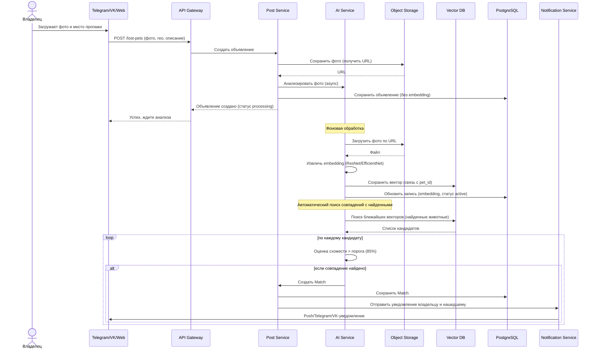
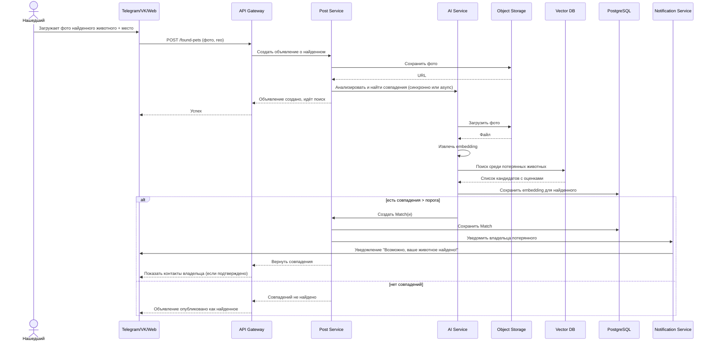
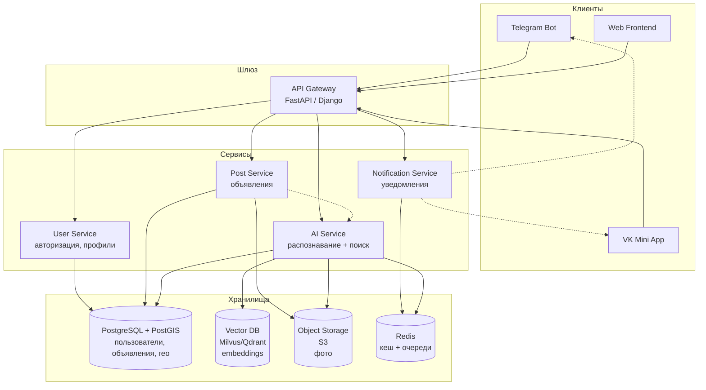
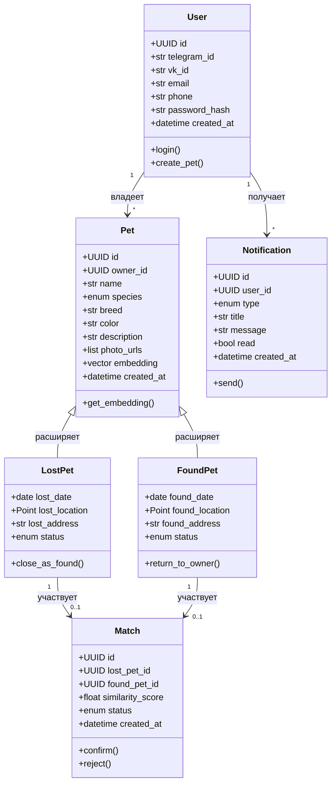

# AI-платформа для поиска домашних животных «PetFinder AI»

## 1. Введение и цели проекта

### 1.1. Описание проекта

Разработать AI-платформу для поиска пропавших домашних животных, которая позволяет пользователям загружать фотографии потерянных или найденных питомцев, а система с помощью искусственного интеллекта сопоставляет изображения, находит потенциальные совпадения и уведомляет заинтересованных пользователей.

### 1.2. Цели проекта

- Создать единую платформу, объединяющую владельцев потерянных животных и людей, нашедших питомцев
- Использовать компьютерное зрение для распознавания уникальных визуальных признаков животных (окрас, форма морды, размер, порода и др.)
- Обеспечить мультиканальный доступ: Telegram-бот, VK Mini App, веб-фронтенд с картой
- Сократить время поиска пропавших животных с нескольких дней до минут

### 1.3. Целевая аудитория

- Владельцы домашних животных (кошки, собаки)
- Люди, нашедшие потерянное животное
- Волонтёры и зоозащитные организации
- Приюты для животных

---

## 2. Функциональные требования

### 2.1. Пользовательские сценарии

#### Сценарий 1: Владелец потерял животное

1. Пользователь авторизуется в системе (Telegram/VK/веб)
2. Загружает 1-3 фотографии пропавшего животного
3. Указывает место пропажи (геолокация или адрес)
4. Заполняет дополнительную информацию: кличка, порода, окрас, особые приметы, дата пропажи
5. Система анализирует фото, создаёт биометрический профиль животного и сохраняет в базе данных
6. Пользователь получает подтверждение о создании объявления
7. При обнаружении совпадения с найденным животным пользователь получает уведомление

#### Сценарий 2: Пользователь нашёл животное

1. Пользователь авторизуется в системе
2. Загружает фотографию найденного животного
3. Указывает место находки
4. Система анализирует фото и ищет совпадения в базе потерянных животных
5. Если найдено совпадение — пользователь видит профиль владельца и может связаться с ним
6. Если совпадений нет — создаётся объявление о найденном животном

#### Сценарий 3: Просмотр карты
1. Пользователь открывает веб-фронтенд с картой
2. На карте отображаются маркеры потерянных и найденных животных
3. Возможна фильтрация по типу (потерян/найден), виду животного, дате, радиусу
4. При клике на маркер открывается карточка с фото и информацией

### 2.2. Модули системы

#### 2.2.1. Модуль авторизации и управления пользователями
- Регистрация/вход через Telegram, VK (OAuth 2.0)
- Ручная регистрация (email/телефон) для веб-версии
- Профиль пользователя с историей объявлений
- Управление уведомлениями

#### 2.2.2. Модуль работы с объявлениями
- Создание объявления о потерянном животном
- Создание объявления о найденном животном
- Редактирование/удаление объявлений
- Статусы объявлений: «активно», «найдено/возвращено», «закрыто»
- История изменения статусов

#### 2.2.3. AI-модуль распознавания и сопоставления
- Извлечение признаков: анализ фото для выделения визуальных характеристик животного (форма морды, окрас, размер, порода, уникальные отметины)
- Биометрический профиль: создание векторного представления (embedding) каждого животного
- Сопоставление: сравнение векторов потерянного и найденного животных с вычислением коэффициента схожести
- Порог совпадения: настраиваемый порог (например, 85%+ — высокое совпадение, 70-85% — возможное совпадение)
- Поддержка: распознавание собак и кошек с возможностью расширения на другие виды
- Валидация загружаемых изображений (наличие животного на фото)

#### 2.2.4. Модуль уведомлений
- Push-уведомления при обнаружении совпадения
- Email-уведомления
- Уведомления в Telegram/VK
- Подписка на новые объявления в заданном радиусе

#### 2.2.5. Модуль карты и геолокации
- Интеграция с картографическим API (Yandex Maps / Google Maps / OpenStreetMap)
- Отображение всех активных объявлений на карте
- Поиск и фильтрация по радиусу (например, «показать в радиусе 5 км»)
- Кластеризация маркеров при большом количестве объявлений

#### 2.2.6. Модуль интеграции с мессенджерами и соцсетями

**Telegram-бот**:
- Команды: /start, /lost (я потерял), /found (я нашёл), /map (ссылка на карту), /help
- Загрузка фото через Telegram
- Указание геолокации через встроенный функционал Telegram
- Получение уведомлений

**VK Mini App**:
- Полноценное приложение внутри ВКонтакте
- Авторизация через VK ID
- Загрузка фото, указание геолокации
- Уведомления через VK Messages

___

## 3. Нефункциональные требования

### 3.1. Производительность

- Время обработки одного фото AI-модулем: не более 3 секунд
- Время сопоставления с базой данных: не более 5 секунд для 10 000 записей
- Время загрузки веб-страницы: не более 2 секунд
- Поддержка до 1000 одновременных пользователей (MVP)

### 3.2. Безопасность

- HTTPS для всех внешних соединений
- Хеширование паролей (bcrypt)
- JWT-аутентификация для API
- Защита от DDoS (rate limiting)
- Модерация контента (проверка загружаемых фото на соответствие правилам)
- Соответствие 152-ФЗ (персональные данные)

### 3.3. Масштабируемость

- Микросервисная архитектура (опционально для MVP — монолит с чёткими модулями)
- Горизонтальное масштабирование AI-модуля
- Использование очередей для асинхронной обработки (Celery + Redis)

### 3.4. Доступность

- Целевой SLA: 99.5% доступности
- Резервное копирование базы данных (ежедневно)

### 3.5. Юзабилити

- Интуитивно понятный интерфейс на всех платформах
- Адаптивный дизайн веб-версии (мобильные + десктоп)
- Поддержка русского языка
- Минимальное количество шагов для создания объявления

___

## 4. Технологический стек

### 4.1. Backend

|Компонен|Технология|Обоснование|
|---|---|---|
|Язык| Python 3.10+|Экосистема ML/AI, быстрота разработки|
|Фреймворк|FastAPI|FastAPI — для высокой производительности|
|База данных|PostgreSQL + PostGIS|Геоданные, надёжность, ACID|
|Кеш/Очереди|Redis|Кеширование, брокер для Celery|
|Фоновые задачи|Celery|Асинхронная обработка фото|
|Хранилище файлов|S3 (Yandex Object Storage / AWS S3 / MinIO)|Хранение фото|

### 4.2. AI/ML

|Компонент|Технология|Обоснование|
|---|---|---|
|Фреймворк|PyTorch / TensorFlow|PyTorch — удобнее для исследований и продакшена|
|Модель извлечения признаков|ResNet-50 / EfficientNet / Vision Transformer (ViT)|Проверенные архитектуры для классификации изображений|
|Обнаружение животных|YOLOv5 / YOLOv8|Быстрое детектирование объектов на фото|
|Векторная БД|Pinecone / Milvus / Qdrant|Быстрый поиск по embedding-векторам|
|API для ML|FastAPI (отдельный микросервис)|Изоляция ML-логики|

### 4.2. AI/ML

|Компонент|Технология|Обоснование|
|---|---|---|
|Фреймворк|PyTorch / TensorFlow|PyTorch — удобнее для исследований и продакшена|
|Модель извлечения признаков|ResNet-50 / EfficientNet / Vision Transformer (ViT)|Проверенные архитектуры для классификации изображений|
|Обнаружение животных|YOLOv5 / YOLOv8|Быстрое детектирование объектов на фото|
|Векторная БД|Pinecone / Milvus / Qdrant|Быстрый поиск по embedding-векторам|
|API для ML|FastAPI (отдельный микросервис)|Изоляция ML-логики|

### 4.3. Frontend

|Компонент|Технология|Обоснование|
|---|---|---|
|Веб-фреймворк|React / Vue.js|React — популярность, экосистема|
|Карты|Yandex Maps API / Leaflet|Yandex — для РФ, Leaflet — OpenSource|
|Стили|Tailwind CSS / Material-UI|Быстрая разработка UI|

### 4.4. Интеграции

|Компонент|Технология|
|---|---|
|Telegram Bot|python-telegram-bot / aiogram|
|VK API|vk-api (Python)|
|VK Mini App|VK Bridge + React|

### 4.5. DevOps

|Компонент|Технология|
|---|---|
|Контейнеризация|Docker + Docker Compose|
|CI/CD|GitHub Actions / GitLab CI|
|Хостинг|Yandex Cloud / AWS / VPS|

---

## 5. Архитектура системы

---

## 6. Модель данных (основные сущности)

--- 

## 7. Этапы разработки (Roadmap)

### Этап 0: Исследование и прототипирование (2-3 недели)

- Исследование существующих решений: Petco Love Lost, Finding Rover, «ХвостРадар»
- Сбор датасета для обучения (фото кошек и собак)
- Эксперименты с моделями (ResNet, EfficientNet, YOLO)
- Выбор финальной архитектуры модели

### Этап 1: MVP Backend (3-4 недели)

- Настройка окружения (Docker, базы данных)
- Разработка базового API (регистрация, создание объявлений)
- Интеграция с S3 для хранения фото
- Реализация AI-модуля (извлечение признаков, сохранение в Vector DB)

## Этап 2: MVP Frontend (3-4 недели)

- Разработка веб-фронтенда (лента объявлений, карта)
- Интеграция с картографическим API
- Реализация формы создания объявления

### Этап 3: Интеграция с мессенджерами (2-3 недели)

- Разработка Telegram-бота (авторизация, загрузка фото, уведомления)
- Разработка VK Mini App

### Этап 4: Тестирование и запуск (2 недели)

- Нагрузочное тестирование
- Бета-тестирование с волонтёрами
- Исправление критических багов
- Публичный запуск MVP

### Этап 5: Доработки и масштабирование (после запуска)

- Улучшение точности модели на основе обратной связи
- Расширение на другие виды животных
- Интеграция с API приютов и волонтёрских организаций
- Мобильное приложение (React Native / Flutter)

---

## 8. Критерии успеха и метрики

### Технические метрики

- Точность распознавания (Recall@10) — не менее 85%
- Время обработки фото — не более 3 секунд
- Доступность API — 99.5%
- Время ответа API — не более 200 мс (p95)

### Бизнес-метрики (на 3 месяца после запуска)

- Количество зарегистрированных пользователей — 1000+
- Количество созданных объявлений — 500+
- Количество успешных возвратов — 50+
- Среднее время поиска — снижение с 7 дней до 24 часов

---

## 9. Риски и их митигация

|Риск|Вероятность|Митигация|
|---|---|---|
|Низкая точность распознавания|Средняя|Использовать ансамбль моделей, дообучать на реальных данных, использовать >500 визуальных маркеров|
|Недостаток данных для обучения|Высокая|Использовать transfer learning, аугментацию данных, открытые датасеты (Oxford Pets, AFHQ)|
|Нагрузка на сервер при росте пользователей|Средняя|Микросервисная архитектура, горизонтальное масштабирование, кеширование|
|Злоупотребления и фейковые объявления|Средняя|Модерация (автоматическая + ручная), верификация через Telegram/VK, жалобы пользователей|
|Юридические риски (персональные данные)|Низкая|Соответствие 152-ФЗ, прозрачная политика конфиденциальности|

---

## 10. Дополнительные возможности (бэклог)

- Распознавание по видео
- Интеграция с камерами видеонаблюдения (для определения последнего местоположения)
- QR-адресники для питомцев с быстрым сканированием
- Чат между владельцем и нашедшим
- Система рейтинга и отзывов пользователей
- API для приютов и волонтёрских организаций
- Подписка на новые объявления в районе

---

## 11. Заключение

Проект «PetFinder AI» представляет собой современное решение для поиска пропавших домашних животных, использующее передовые технологии компьютерного зрения и доступное через множество каналов (Telegram, VK, веб-сайт). MVP может быть реализован силами одного Python-разработчика за 3-4 месяца с использованием описанного технологического стека. Ключевой фактор успеха — качество AI-модели, поэтому рекомендуется начать с экспериментов по распознаванию и сбору датасета.
